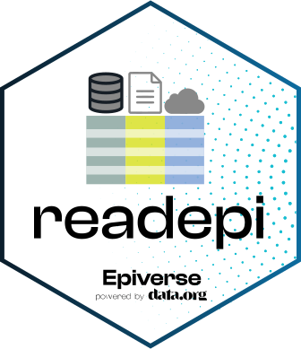

<!-- README.md is generated from README.Rmd. Please edit that file. -->

<!-- The code to render this README is stored in .github/workflows/render-readme.yaml -->

<!-- Variables marked with double curly braces will be transformed beforehand: -->

<!-- `packagename` is extracted from the DESCRIPTION file -->

<!-- `gh_repo` is extracted via a special environment variable in GitHub Actions -->

# readepi: Read data from health information systems 

<!-- badges: start -->

[](https://opensource.org/license/mit)
[](https://github.com/epiverse-trace/readepi/actions/workflows/R-CMD-check.yaml)
[](https://app.codecov.io/gh/epiverse-trace/readepi?branch=main)
[](https://www.reconverse.org/lifecycle.html#concept)
<!-- badges: end -->

**readepi** is an R package for reading data from several health
information systems (HIS) and relational database management systems
(RDBMS).

**readepi** currently supports reading data from the followings:

- RDBMS (Relational Database Management Systems) including MS SQL,
  MySQL, PostgreSQL, and SQLite 
- [DHIS2](https://dhis2.org/about-2/): an open source and web-based
  platform for managing health information  
- [SORMAS](https://sormas.org/): an eHealth system for monitoring the
  spread of infectious diseases and responding to outbreak situations

**readepi** returns a data frame with the data from the specified
system.

**readepi** is developed by
[Epiverse-TRACE](https://data.org/initiatives/epiverse/) team at the
[Medical Research Center, The Gambia unit at London School of Hygiene
and Tropical
Medicine](https://www.lshtm.ac.uk/research/units/mrc-gambia).

## Installation

**readepi** can be installed from CRAN using

``` r
install.packages("readepi")
```

The latest development version of **readepi** from
[GitHub](https://github.com/epiverse-trace/readepi) with:

``` r
if (!require("pak")) install.packages("pak")
pak::pak("epiverse-trace/readepi")
library(readepi)
```

## Quick start

**readepi** currently has three main functions that read data from a
specified source. While the arguments to these functions are generally
similar, some are specific to their data source (see the **vignette**
for more details). The examples below show how to use the package
functionalities to import data from a variety of sources.

### Reading data from RDBMS

The `read_rdbms()` function is used to import data from a variety of
RDBMS, including MS SQL, MySQL, PostgreSQL, and SQLite. Reading data
from a RDBMS requires:

- A MS SQL driver that is compatible with the version of DBMS of
  interest. The [install drivers
  vignette](./vignettes/install_drivers.Rmd) vignette describes how to
  install the appropriate driver for each database management system.

Users can read data from a RDBMS by providing a list with the query
parameters of interest or an SQL query (for more information, see the
**vignette**).

``` r
# CONNECT TO THE TEST MYSQL SERVER
rdbms_login <- readepi::login(
  from = "mysql-rfam-public.ebi.ac.uk",
  type = "mysql",
  user_name = "rfamro",
  password = "",
  driver_name = "",
  db_name = "Rfam",
  port = 4497
)

# DISPLAY THE LIST OF TABLES FROM A DATABASE OF INTEREST
tables <- readepi::show_tables(login = rdbms_login)

# READING ALL FIELDS AND ALL RECORDS FROM ONE TABLE (`author`) USING AN SQL QUERY
dat <- readepi::read_rdbms(
  login = rdbms_login,
  query = "select * from author"
)

# SELECT FEW COLUMNS FROM ONE TABLE AND LEFT JOIN WITH ANOTHER TABLE
dat <- readepi::read_rdbms(
    login = rdbms_login,
    query = "select author.author_id, author.name,
  family_author.author_id from author left join family_author on
  author.author_id = family_author.author_id"
)

# READING ALL FIELDS AND ALL RECORDS FROM ONE TABLE (`author`) WHERE QUERY PARAMETERS ARE SPECIFIED AS A LIST
dat <- readepi::read_rdbms(
  login = rdbms_login,
  query = list(table = "author", fields = NULL, filter = NULL)
)
```

### Reading data from DHIS2

``` r
# CONNECT TO A DHIS2 INSTANCE
dhis2_login <- readepi::login(
  type = "dhis2",
  from = "https://smc.moh.gm/dhis",
  user_name = "test",
  password = "Gambia@123"
)

# IMPORT DATA FROM DHIS2 FOR THE SPECIFIED ORGANISATION UNIT AND PROGRAM IDs
data <- readepi::read_dhis2(
  login = dhis2_login,
  org_unit = "GcLhRNAFppR",
  program = "E5IUQuHg3Mg"
)
```

### Reading data from SORMAS

``` r
# CONNECT TO THE SORMAS SYSTEM
sormas_login <- readepi::login(
  type = "sormas",
  from = "https://demo.sormas.org/sormas-rest",
  user_name = "SurvSup",
  password = "Lk5R7JXeZSEc"
)

# FETCH ALL COVID (coronavirus) CASES FROM THE TEST SORMAS INSTANCE
covid_cases <- readepi::read_sormas(
  login = sormas_login,
  disease = "coronavirus",
)
```

## Package Vignettes

The vignette of the **readepi** package contains detailed illustrations
about the use of each function and the description of every argument.
This can be accessed by typing the command below:

``` r
# OPEN THE VIGNETTE WITHIN RSTUDIO
vignette("readepi")

# OPEN THE VIGNETTE IN YOUR WEB BROWSER.
browseVignettes("readepi")
```

## Development

### Lifecycle

This package is currently *maturing*, as defined by the [RECON software
lifecycle](https://www.reconverse.org/lifecycle.html). This means that
it can be used in production with the understanding that the interface
may still undergo minor changes.

### Contributions

Contributions are welcome via [pull
requests](https://github.com/epiverse-trace/readepi/pulls).

### Code of Conduct

Please note that the readepi project is released with a [Contributor
Code of
Conduct](https://github.com/epiverse-trace/.github/blob/main/CODE_OF_CONDUCT.md).
By contributing to this project, you agree to abide by its terms.

## Citing this package

``` r
citation("readepi")
#> To cite readepi in publications use:
#> 
#>   Karim Mané, Emmanuel Kabuga, Bankolé Ahadzie, Abdoelnaser
#>   Degoot, Nuredin Mohammed, Bubacarr Bah (2025). readepi: Read
#>   Data From Relational Database Management Systems and Health
#>   Information Systems website:
#>   https://epiverse-trace.github.io/readepi/
#> 
#> A BibTeX entry for LaTeX users is
#> 
#>   @Manual{,
#>     title = {Read Data From Health Information Systems},
#>     author = {Karim Mané and Emmanuel Kabuga and Nuredin Mohammed and Bubacarr Bah and Bankolé Ahadzie and Abdoelnaser Degoot},
#>     year = {2025},
#>     url = {https://github.com/epiverse-trace/readepi},
#>   }
```
