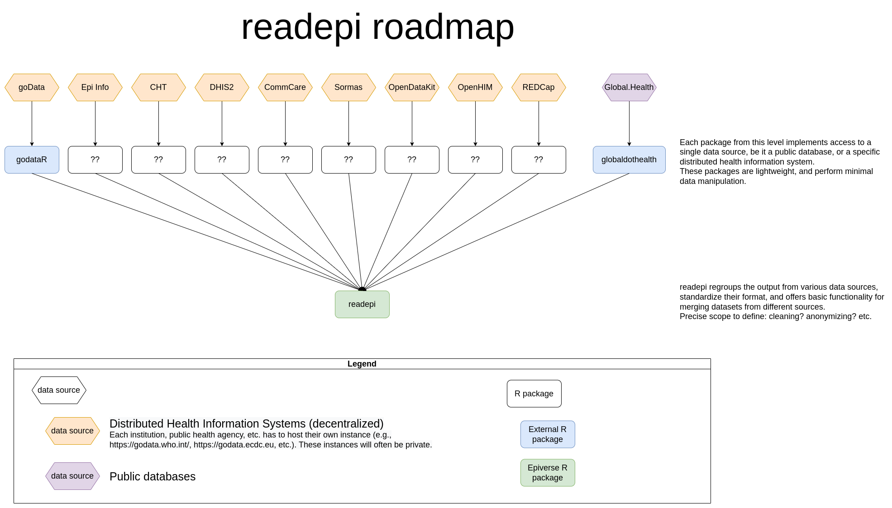

```{r, include = FALSE}
knitr::opts_chunk$set(
  collapse = TRUE,
  comment  = "#>"
)
```

Being able to import epidemiological-related data from the multiple sources plays an important role in providing real time accurate estimations and inferences during an outbreak. This is one of the central tasks in the early stage of the [Epiverse]() pipelines and workflows. As such, we thought of a centralized tool that will provide users with the possibility of importing data from various health information systems (HIS).

In this vignette, we outline the design decisions that will guide the development strategies of the {readepi} R package, as well as some of the reasoning, and possible pros and cons of each decision.

## Concept and motivation

There are several R packages designed to access data from specific HIS. They are usually tied to a single HIS and can't be used to query others. {fingertipsR}, {REDCapR}, {godataR}, {globaldohealth} can be used to fetch data from [Fingertips](), [REDCap](), [goData](), and [Global.Health]() respectively. In these packages, the API end points are accessed differently (please read how this is done from every package and state the differences). This introduces the challenge of having a unified framework for importing data from these HIS into R.

To address this challenge, PIs of the [Epiverse-TRACE]() came with a list of potential data sources for which we aim at building a tool to make requests and fetch the data of interest in the same way. The data sources include: distributed health information systems, and public databases as shown in the figure below. (Please edit this figure and include DHS - talk to Hugo to know how he built this).



## Scope

The {simulist} package aims to simulate data on infectious disease outbreaks, primarily line list data, but also contacts data. Each of these output types have an associated exported function: `sim_linelist()` and `sim_contacts()`. There is also a function to simulate and output both of these data types, `sim_outbreak()`. This latter function is useful for interoperability with the [{epicontacts} R package](https://CRAN.R-project.org/package=epicontacts) (see [visualisation vignette](vis-linelist.html)), and provides linked line list and contacts datasets, which are common in outbreaks, such as the MERS dataset within the [{outbreaks} R package](https://CRAN.R-project.org/package=outbreaks).

## Output

The simulation functions either return a `<data.frame>` or a `list` of `<data.frame>`s. This consistency across functions of a well-known data structure makes it easy to understand for users.

## Design decisions

- When using age-stratified rates of hospitalisation and deaths (see [Age-stratified hospitalisation and death rates vignette](age-strat-rates.html) for details) there is an interaction between function arguments. The `<data.frame>` that defines the age-stratification in `hosp_rate`, `hosp_death_rate` and `non_hosp_death_rate` arguments gives the lower bound of the age groups. The upper bound of the age groups is derived from the next lower bound, but the upper bound oldest age group is defined by the upper age given to the `population_age` argument. This interaction of arguments is not ideal, as it can be more difficult to understand for users (as outlined in [The Tidy Design book](https://design.tidyverse.org/independent-meaning.html#whats-the-problem)), however, the interaction does not change the interpretation of each argument which would be more convoluted. This design decision was taken when we changed the structure of the `<data.frame>` accepted as input to the `*_rate` arguments from having two columns for a lower and upper age limit, to a single column of lower age bounds. This change was made in [pull request #14](https://github.com/epiverse-trace/simulist/pull/14) and follows the design of [{socialmixr}](https://github.com/epiforecasts/socialmixr/blob/main/R/contact_matrix.r) for defining age bounds. The newer structure is judged to be preferred as it prevents input errors by the user when the age bounds are overlapping or non-contiguous (i.e. missing age groups).

- The column names of the contact relationships (edges of the network) are called `from` and `to`. Names of contacts table match {epicontacts} `<epicontacts>` objects. If the column names of the two contacts provided to `epicontacts::make_epicontacts()` arguments `from` and `to` are not `from` and `to` they will be silently renamed in the resulting `<epicontacts>` object. By making these column names `from` and `to` when output from `sim_contacts()` or `sim_outbreak()` it prevents any confusion when used with {epicontacts}. This names are also preferred as they are usefully descriptive.

- The [Visualising simulated data vignette](vis-linelist.html) contains interactive data visualisation when rendered to the web. This enforces some limitations. The vignette uses `output: rmarkdown::html_document()` instead of `output: bookdown::html_vignette2` and does not contain `pkgdown: as_is: true` in the yaml metadata, in order for the interactive figures to render and operate correctly. This means that the vignette figures will not automatically be numbered and start with "Figure _x_" (where _x_ is replaced by a number). Instead, it was decided for this vignette that this information would be manually written, and then manually updated if the number or order of the figures changed. This is not an ideal solution and automation is preferred, but on balance, it was decided that the addition of interactive visualisation from {epicontacts} outweighed the downside of manual figure labelling.

- Exported functions that simulate data use the naming convention `sim_*()` (where `*` is the placeholder). Internal functions that simulate have a dot (`.`) prefix (e.g. `.sim_bp_linelist()`). Functions that create fixed data structures (i.e. data factory functions) have the naming convention (`create_*()` or `.create_*()`).

- The use of a `config` argument in the simulation function is to reduce the number of arguments in the exported functions and provide as simple a user-interface as possible. The choice of what gets an argument in the function body and what is confined to `config` list is based on preconceived frequency of use, importance and technical detail. That is to say, settings that are unlikely to be changed by the user or if they are changed require an advanced understanding of the simulation model are placed within the `config`, and given default values with `create_config()`.

- The column names of the line list data produced by `sim_linelist()` and `sim_outbreak()` matches the tag names used in the [{linelist} R package](https://CRAN.R-project.org/package=linelist) (an [Epiverse-TRACE R package](https://github.com/epiverse-trace)). This is for continuity of design more than any functional reason. The line list data from {simulist} functions is not tagged _sensu_ [{linelist} tagging](https://epiverse-trace.github.io/linelist/articles/linelist.html). There is an inconsistent use of _hospitalisation_ and _admission_; in the simulated line list it is `date_admission`, but internally the package uses hospitalisation (e.g. `.add_hospitalisation()`). This is because I think _hospitalisation_ is more descriptive but `date_admission` is used by {linelist}.

## Dependencies

The aim is to restrict the number of dependencies to a minimal required set for ease of maintenance. The current hard dependencies are:

* {stats}
* [{checkmate}](https://CRAN.R-project.org/package=checkmate)
* [{epiparameter}](https://github.com/epiverse-trace/epiparameter)
* [{bpmodels}](https://github.com/epiverse-trace/bpmodels)
* [{randomNames}](https://CRAN.R-project.org/package=randomNames)

{stats} is distributed with the R language so is viewed as a lightweight dependency, that should already be installed on a user's machine if they have R. {checkmate} is an input checking package widely used across Epiverse-TRACE packages. {epiparameter} is used to easily access epidemiological parameters from the package's library, the package is currently unstable and actively developed, however, by using it in another package it can inform the development path of {epiparameter}. {bpmodels} is used to handle the single-type branching process model, this is taken on as a dependency as implementing different transmission models within {simulist} is beyond the package scope and does not scale as we implement more models to generate line list data. {randomNames} provides a utility function for generating random names for case and contact data. The functionality could be replicated in {simulist}, however the {randomNames} package is maintained and contains a range of name generation settings which warrants its use as a dependency.

The soft dependencies (and their minimum version requirements) are:

* [{incidence2}](https://CRAN.R-project.org/package=incidence2) (>= 2.1.0)
* [{epicontacts}](https://CRAN.R-project.org/package=epicontacts) (>= 1.1.3)
* [{knitr}](https://CRAN.R-project.org/package=knitr)
* [{ggplot2}](https://CRAN.R-project.org/package=ggplot2)
* [{bookdown}](https://CRAN.R-project.org/package=bookdown)
* [{rmarkdown}](https://CRAN.R-project.org/package=rmarkdown)
* [{spelling}](https://CRAN.R-project.org/package=spelling)
* [{testthat}](https://CRAN.R-project.org/package=testthat) (>= 3.0.0)

{knitr}, {bookdown}, {rmarkdown}, are all used for generating documentation. {spelling} and {testthat} are used for testing the code base. {ggplot2} is used for plotting within the vignettes. {incidence2} and {epicontacts} are used in vignettes to demonstrate interoperability with downstream packages, with a focus on data visualisation.

## Contribute

There are no special requirements to contributing to {simulist}, please follow the [package contributing guide](https://github.com/epiverse-trace/.github/blob/main/CONTRIBUTING.md).
