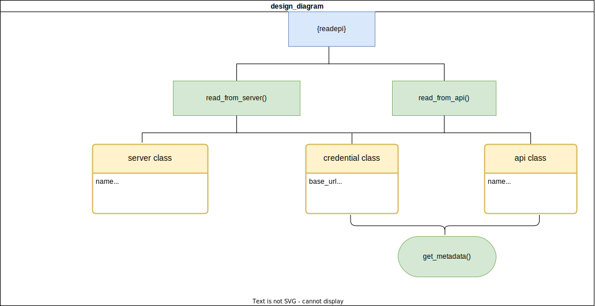

```{css, echo = FALSE}
.section {
  opacity: 1;
}
```

```{r, include = FALSE}
knitr::opts_chunk$set(
  collapse = TRUE,
  comment  = "#>"
)
```

## Concept and motivation

This document outlines the design decisions that is guiding the development strategies of the {readepi} R package, the reasoning behind them, as well as the possible pros and cons of each decision.

Importing data from “whatever source of it” into `R` environment is the first step in many workflows of outbreak analysis. Epidemiological data are often stored in files of different formats. The most popular among those formats being: ‘.txt’, ‘.tab’, ‘.csv’, ‘.xlxs’, etc.

Many R packages have been developed over the years to facilitate the importation of data stored in such files. We recommend the [{rio}](http://gesistsa.github.io/rio/) package for importing data that are relatively of small size and the [{data.table}](https://cran.r-project.org/web/packages/data.table/vignettes/) package for large files.

To enable easy and real time access of well structured data, most organisations in the world are now storing their data in public repositories, relational database management systems (RDBMS), and health information systems (HIS) wrapped with specific Application Programming Interfaces (APIs). As such, we aim at building a centralized tool that will provide users with the possibility of importing data from various HIS and RDBMS.

Our first attempt consisted in using the currently available R packages designed to access data from specific HIS. These packages are usually tied to a single HIS and can't be used to query others. {fingertipsR}, {REDCapR}, {godataR}, {globaldothealth} can be used to fetch data from [Fingertips](https://fingertips.phe.org.uk/), [REDCap](https://projectredcap.org/software/), [goData](https://www.who.int/tools/godata), and [Global.Health](https://global.health/) respectively. In version **0.1.0** of the {readepi} package, when a user is requesting data from a specific HIS, its correspondent package is called internally. 

As each package was designed to target a specific HIS, this approach increases our dependency to many other packages and introduces the challenge of having a unified framework for importing data from multiple HIS.

To address this challenge, PIs of the [Epiverse-TRACE](https://data.org/initiatives/epiverse/) came with a list of potential data sources for which we aim at building a tool to request and fetch the data of interest from multiple source in the same way. The data sources include: distributed health information systems, and public databases as shown in the figure below.


## Scope

The {readepi} package intends to import data from two common sources of institutional health-related data: health information systems (HIS) wrapped with specific Application programming interfaces (APIs) and relational database management systems (RDBMS) that run on specific servers.

Importing data from any of these sources requires the user to have the right access. The user is also expected to provide the relevant query parameters to fetch the target data.
Hence, the {readepi} package is structured around one main function (`read_epidata()`) and two auxiliary functions (`authenticate()` and `get_metadata()`).

The previous version of {readepi} (`0.1.0`) supports importing data from HIS APIs such as REDCap (Research Electronic Data Capture), DHIS2 (District Health Information System 2), and Fingertips as well as RDBMS such as MS SQL, SQLite, MYSQL, and PostgreSQL. 

In the next versions, the `read_epidata()` function will also allow data import from HIS like GoData, Globaldothealth, SORMAS, and ODK. It will also include functionalities for importing data from RDBMS such as MS ACCESS, and SQlite.




## Output

The `read_epidata()` functions return a `list` object containing one or more `data frames`. Each `data frame` corresponds to the data from a specified source.
The `get_metadata()` function returns a data dictionary containing information about the data structure.
The `authenticate()` function returns a connection object that is used in the query request.

## Design decisions

The aim of {readepi} is to simplify and standardize the process of fetching health data from APIs and servers. We ambition to make it require minimal arguments to access and pull the data of interest from the target source.

* `authenticate()`: a function used to authenticate a user (check who the user is) and check whether the user is authorized to access the requested database or API. This function is fundamental to establish the connection to the source, ensuring the success of data import.

We will ensure that once an argument is provided for the authentication, it is easily retrieved from the connection object, and used in the 2 other functions, hence preventing from been supplied again in another request.

```{r authenticate, fig.align='center', echo=FALSE}
DiagrammeR::grViz("digraph{
 
      graph[rankdir = LR]
  
      node[shape = rectangle, style = filled, fontname = Courier,
      align = center]
  
      subgraph cluster_0 {
        graph[shape = rectangle]
        style = rounded
        bgcolor = LightBlue
    
        label = 'authenticate()'
        node[shape = rectangle, fillcolor = LemonChiffon, margin = 0.25]
        A[label = 'type: the source name']
        B[label = 'from: the URL, or IP address, or hostname']
        C[label = 'user_name: the user name']
        D[label = 'password: the password or API token or key']
        E[label = 'db_name: the database name (RDBMS only)']
        F[label = 'port: the port id (RDBMS only)']
        G[label = 'driver_name: the driver name (RDBMS only)']
      }
      
}")

```

The `type` argument refers to the name of the data source of interest. The current version of the package will cover the followings:

    i) RDBMS: “MS SQL”, “MySQL”, “PostgreSQL”, “SQLite”, “MS ACCESS”,
    ii) APIs: “REDCap”, “DHIS2”, “ODK”, “Fingertips”, “goData”, “SORMAS”


* `get_metadata()`: will be used to retrieve the data schema (table list + data dictionary) from a database or the data dictionary from an endpoint of the target API. It offers interoperability with the `clean_based_on_dictionay()` function of the [{cleanepi}](https://epiverse-trace.github.io/cleanepi/) R package.

```{r get_metadata, fig.align='center', echo=FALSE}
DiagrammeR::grViz("digraph{
 
      graph[rankdir = LR]
  
      node[shape = rectangle, style = filled, fontname = Courier,
      align = center]
  
      subgraph cluster_0 {
        graph[shape = rectangle]
        style = rounded
        bgcolor = LightBlue
    
        label = 'get_metadata()'
        node[shape = rectangle, fillcolor = LemonChiffon, margin = 0.25]
        A[label = 'conn: the connection object made from authenticate()']
        B[label = 'endpoint: the path to the target endpoint (APIs only)']
        C[label = 'query: a list with the query parameters']
      }
}")
```

* `read_epidata()`: this is the main function of the package. It can be used to read from both HIS and RDBMS.

```{r read, fig.align='center', echo=FALSE}
DiagrammeR::grViz("digraph{
 
      graph[rankdir = LR]
  
      node[shape = rectangle, style = filled, fontname = Courier,
      align = center]
  
      subgraph cluster_0 {
        graph[shape = rectangle]
        style = rounded
        bgcolor = LightBlue
    
        label = 'read()'
        node[shape = rectangle, fillcolor = LemonChiffon, margin = 0.25]
        A[label = 'conn: the connection object made from authenticate()']
        B[label = 'endpoint: the path to the target endpoint (APIs only)']
        C[label = 'query: a list with the query parameters']
      }
}")
```

An internal function (`read_*` where `*` is the source name) is designed for fetching data from a specific HIS. This implementation will make it possible to perform updates on a specific function, while conserving the remaining structures (easy maintenance).

```{r fig.align='center', echo=FALSE}
DiagrammeR::DiagrammeR("
graph TB
    A[read_epidata]
    A --> B(read_rdbms)
    A --> D(read_redcap)
    A --> E(read_dhis2)
    A --> F(read_fingertips)
    A --> G(read_sormas)
    A --> H(read_ODK)
    A --> I(read_godata)
")
```

Note that, when reading from RDBMS, the `query` argument could be an [SQL query]{.underline} or a [list with a vector of table names, fields and rows to subset on]{.underline}.
For HIS, the elements of this list can vary depending on the API that is been queried. We strongly recommend reading the vignette on the [query_parameters](./query_parameters.Rmd) for more details.

## Mitigate API security risks

To prevent from APIs security risks and issues, we will ensure that our API requests follow the practices listed below:

1. Identify API gateway (centralized point of entry) and send authentication requests to this gateway
2. Make sure users access only the data they are allowed to:
    * use OAuth or token-based authentication if possible
    * determine the data a user can have access to. Send a meaningful error message when a user attempts to access unauthorized data.
3. Make sure API key is not sent as part of the URL to avoid it been copied from the proxy logs or other places
4. Control the number of requests that can be sent in a time period, and the number of pages that to be returned in the API response.
5. Prevent from sending/receiving malicious data:
    * use parameterized query
    * validate and sanitize inputs
6. Continuously maintain our hard-coded resources:
    * regularly review and decommission unused APIs
    * maintain and update list of all endpoints


## Dependencies

* The `read_epidata()` will rely mainly on 2 packages:

  [{httr2}](https://CRAN.R-project.org/package=httr2) or [{data.table}](https://CRAN.R-project.org/package=data.table): this will serve in constructing and performing the API requests,
  [{dplyr}](https://CRAN.R-project.org/package=dplyr): will be used for its data wrangling functionalities.

* The `read_from_server()` will rely mainly on the packages below:

  [{DBI}](https://CRAN.R-project.org/package=DBI): for its functionalities to connect, and fetch data from a table in a database,
  [{pool}](https://CRAN.R-project.org/package=pool): for its ability to handle multiple connection,
  [{odbc}](https://CRAN.R-project.org/package=odbc): for its drivers required to fetch data from several DBMS,
  [{RMySQL}](https://CRAN.R-project.org/package=RMySQL): for its drivers to fetch data from MySQL databases.

It also has a system dependency for OS-X and Linux users. This will be described in details in the vignette.

Both functions will require all other packages that are needed in the package development process including:

  [{checkmate}](https://CRAN.R-project.org/package=checkmate),
  [{httptest2}](https://CRAN.R-project.org/package=httptest2),
  [{bookdown}](https://CRAN.R-project.org/package=bookdown),
  [{rmarkdown}](https://CRAN.R-project.org/package=rmarkdown),
  [{testthat}](https://CRAN.R-project.org/package=testthat) (>= 3.0.0),
  [{knitr}](https://CRAN.R-project.org/package=knitr)

## Contribute

There are no special requirements to contributing to {readepi}, please follow the [package contributing guide](https://github.com/epiverse-trace/.github/blob/main/CONTRIBUTING.md).
